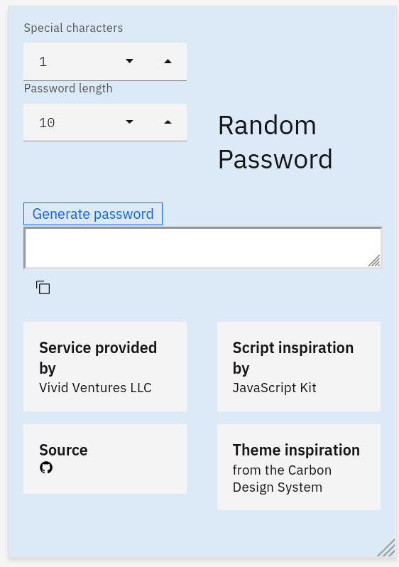

# Random Password Generator

> Showcasing the Carbon Design system with Vanilla Javascript

This app generates a password once the user clicks the `generate` button.
There are options to increase the quantity of special characters and the
total length of the password.

## Screenshot



----

## Usage

```html
<html>
    <head>
        ...
        <!-- get the latest from the develop branch -->
        <script src="https://cdn.jsdelivr.net/gh/VividVenturesLLC/random-password-generator/assets/js/random-password-generator.js"></script>
        ...
    </head>
    ...
```

in your code

```javascript
// javascript
rpg.generatepass( passwordLength,numberOfSpecialCharacters )
rpg.generatepass( 10,3 )
// OR
RandomPasswordGenerator.generatepass( 10,3 )
// returns:
//     a ten character password with three special characters, ie
//    "%3zDd!%ZMd" excluding the quotes ""

```
