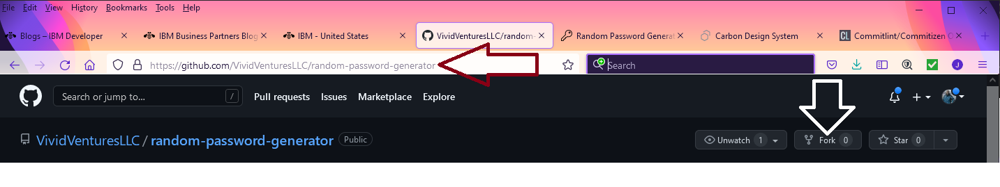
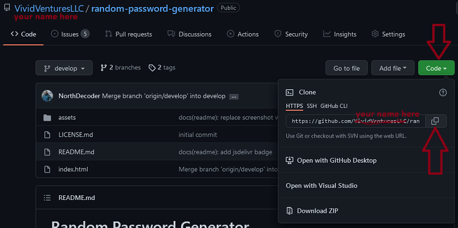
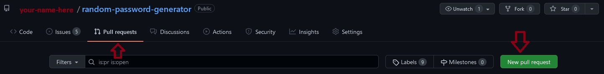
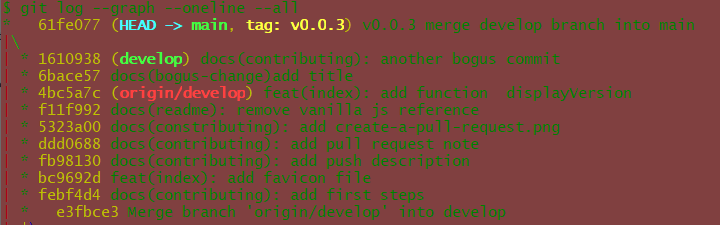
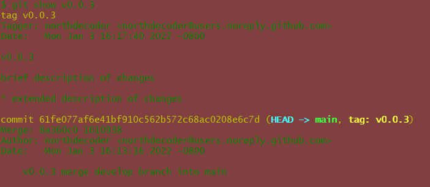

# Contributing

## In your editing environment

1. Fork the project on github into your own workspace. See fork-a-repo [help](https://docs.github.com/en/get-started/quickstart/fork-a-repo).
[](https://docs.github.com/en/get-started/quickstart/fork-a-repo)

2. Make a clone of your fork of the project into a working directory on your computer. See cloning-your-forked-repository [help](https://docs.github.com/en/get-started/quickstart/fork-a-repo#cloning-your-forked-repository).
[](https://docs.github.com/en/get-started/quickstart/fork-a-repo#cloning-your-forked-repository)

   - click on the code button
   - then click on the copy button
   - as shown in the terminal below paste your copied link

    ```bash
    # in a terminal on the command line type:
    cd <my_working_directory_name>

    # git clone <paste link here>
    git clone https://github.com/<my-user-name-here>/random-password-generator.git
    ```

3. Change into the newly acquired directory

    ```bash
   cd random-password-generator
   # make sure the project is on the develop branch
   git checkout develop
    ```

4. Make the proposed changes

   ```bash
   vim CONTRIBUTING.md # (or whatever)
   :wq  # write to file and quit vim
   ```

   - test the changes 🔥

5. Commit and push the changes to your repository

   ```bash
   # make sure the project is on the develop branch
   git status
   git add <file-name-that-changed-here>
   # use https://commitlint.io/
   #     to help create a properly linted commit message
   git commit -m "docs(contributing): add push description"
   git push origin
   ```

6. Create a pull request from your fork to the upstream project. See creating-a-pull-request-from-a-fork [help](https://docs.github.com/en/pull-requests/collaborating-with-pull-requests/proposing-changes-to-your-work-with-pull-requests/creating-a-pull-request-from-a-fork).

   [](https://docs.github.com/en/pull-requests/collaborating-with-pull-requests/proposing-changes-to-your-work-with-pull-requests/creating-a-pull-request-from-a-fork)

----

## Version management

> Project maintainers will facilitate the change of version numbers according
> to [semver](https://semver.org/) in the upstream repository.
> Contributors *must not* implement the following steps.

The `random-password-generator.js` script is the main feature of this
repository, however the `index.html` demonstration page plays a
significant role.

Changes to index will be considered minor or patch as there is effectively
no API.  Since random-password-generator can be used as a module, changes
could be considered for a major release if the changes affect the API.

Update the following line in file `random-password-generator.js`
each time there is a version applied to a git tag. The git tag should be
the same as my.version, so a user can request the version from the script.

```javascript
- my.version = "0.0.2";
+ my.version = "0.0.3";
```

1. Once changes have been tested, added and
committed, the maintainers will decide upon
   a new version number in semver style to be applied to the tag.

   ```bash
   cd ~/my_working_directory_name/random-password-generator
   # list the previous versions for reference
   git tag --list
   ```

   Something like vX.Y.Z, where X,Y,Z become numbers
   as in v.0.0.3

2. [Merge](https://git-scm.com/docs/git-merge) the develop branch into the
   main branch

   ```bash
   git checkout main

   # use --no-ff to keep all the commit history
   git merge --no-ff develop -m "vX.Y.Z merge develop branch into main "
   ```

3. [Tag](https://git-scm.com/book/en/v2/Git-Basics-Tagging) the commit

   ```bash
   git tag -a vX.Y.Z -m "vX.Y.Z" \
                     -m "brief description of changes"\
                     -m "* extended description of changes"
   ```

   Make sure to change the version number in both places in
   the tag command.

   The log of the workflow should look something like:
   

   The full message for the tag looks like:
   

4. [Push](https://git-scm.com/docs/git-push) the changes to the
   upstream repository

   ```bash
   # explicity push the tag
   git push origin vX.Y.Z
   ```

5. To continue developing, [checkout](https://git-scm.com/docs/git-checkout)
   the develop branch.

   ```bash
   git checkout develop
   ```
